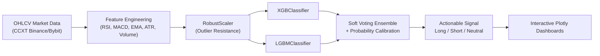

# 🤖 Applied Machine Learning & Algorithmic Predictive Models

[](#)
[](#)
[](#)
[](#)
[](#)
[](#)
[](LICENSE)

> Production-grade machine learning pipelines, time-series cryptocurrency momentum prediction, ensemble gradient boosting (XGBoost + LightGBM), and mathematical modeling implemented from first principles.

---

## 🔬 Core Modeling Frameworks & Highlights

### 1. 15-Minute Cryptocurrency Predictive Ensemble (`Solana Signal 15 min` & `ANTI_GRAVITY REVISED SOL`)
An end-to-end quantitative trading signal architecture engineered for high-frequency cryptocurrency volatility ($SOL/USDT):
- **Data Ingestion:** Real-time and historical OHLCV data streaming using `ccxt` exchange wrappers.
- **Technical Feature Engineering (`ta`):**
  - Relative Strength Index (RSI)
  - Moving Average Convergence Divergence (MACD)
  - Exponential Moving Averages (EMA 9, 21, 50, 200)
  - Average True Range (ATR) for volatility normalization
  - Bollinger Bands and volume momentum oscillators
- **Ensemble Architecture:** Soft-voting ensemble combining **XGBoost** and **LightGBM** classifiers.
- **Probability Calibration:** Applied `CalibratedClassifierCV` (Platt Scaling / Isotonic Regression) to transform raw margin outputs into true conditional trade probabilities $P(\text{Up} \mid X_t)$.
- **Interactive Visualizations:** Multichannel candlestick and indicator dashboards built using `plotly.graph_objects` with subplots.



---

### 2. Matrix Linear Regression from First Principles (`Solana Chart prediction Linear Regression.ipynb`)
Implemented closed-form Ordinary Least Squares (OLS) via pure matrix linear algebra without relying on high-level black-box estimators:
$$\hat{\mathbf{w}} = (\mathbf{X}^T \mathbf{X})^{-1} \mathbf{X}^T \mathbf{y}$$
- **Data Preprocessing:** Feature normalization, train-test chronological splitting to prevent lookahead bias.
- **Mathematical Computation:** Direct transpose dot products ($\mathbf{X}^T\mathbf{X}$, $\mathbf{X}^T\mathbf{y}$) and matrix inversion to extract optimal weight vectors.
- **Evaluation:** Mean Squared Error (MSE), Root Mean Squared Error (RMSE), and coefficient of determination ($R^2$).

---

### 3. Probabilistic Naive Bayes Classification (`Naive Bayes Playing Match Prediction.ipynb` & `CSV_File_Naive_Bayes_Algo.ipynb`)
Supervised probabilistic inference applying Bayes' Theorem under conditional independence assumptions:
$$P(C_k \mid \mathbf{x}) = \frac{P(C_k) \prod_{i=1}^n P(x_i \mid C_k)}{P(\mathbf{x})}$$
- Prior probability estimation $P(C_k)$ from empirical label frequencies.
- Likelihood calculations with Laplace smoothing to mitigate zero-frequency dilemmas.
- Evaluation across multi-attribute discrete datasets.

---

## 📂 Repository Contents

| File / Notebook | Paradigm | Description |
| :--- | :--- | :--- |
| **`Solana Signal 15 min CLAUDE.ipynb`** | Supervised Time-Series | 15-minute timeframe Solana signal generation with calibrated XGBoost probabilities. |
| **`ANTI_GRAVITY REVISED SOL .ipynb`** | Hybrid Ensemble | Multi-model ensemble (XGBoost + LightGBM + RobustScaler) with interactive Plotly dashboards. |
| **`Solana Chart prediction Linear Regression.ipynb`** | Matrix OLS Regression | Analytical closed-form linear regression computed from linear algebra dot products. |
| **`Naive Bayes Playing Match Prediction.ipynb`** | Probabilistic Classifier | Categorical Naive Bayes decision boundary for sporting condition predictions. |
| **`CSV_File_Naive_Bayes_Algo.ipynb`** | Tabular Inference | File-driven Naive Bayes model trained on tabular CSV attributes. |
| **`student_data.csv`** | Dataset | Tabular benchmark dataset for classification verification. |

---

## 🚀 Installation & Environment Setup

```bash
# Clone repository
git clone https://github.com/arslantariq364/Machine-Learning-Algorithms.git
cd Machine-Learning-Algorithms

# Create virtual environment
python3 -m venv venv
source venv/bin/activate

# Install required dependencies
pip install numpy pandas scikit-learn xgboost lightgbm ccxt ta plotly matplotlib jupyter

# Launch notebook environment
jupyter notebook
```

---

## 👨‍💻 Author

**Arslan Tariq**  
*Computer Science Undergraduate @ FAST NUCES*  
*Applied Physics Teaching Assistant*  
[GitHub Profile](https://github.com/arslantariq364)

---

## 📜 License

Distributed under the MIT License. See [LICENSE](LICENSE) for details.
